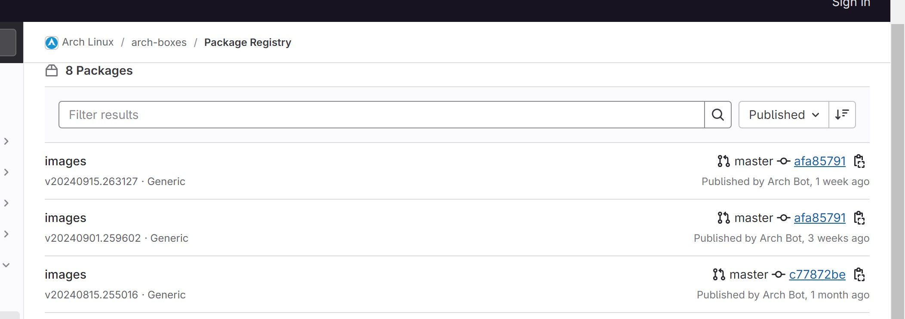

# Creating a Remote Server on DigitalOcean with Arch Linux

## Introduction

In this tutorial, you will be guided through the process of setting up an Arch Linux server (Droplet) on DigitalOcean. You will create SSH keys to securely connect to the server, add a custom Arch Linux image, and automate server setup using cloud-init. You should have a good understand on how to securely access your server without a password, and why automation is crucial in server administration.


## Table of Contents

1. What are SSH Keys?
2. Creating SSH Keys
3. Adding SSH Keys to DigitalOcean
4. Adding a Custom Arch Linux Image
5. Creating an Arch Linux Droplet
6. Connecting to Your Droplet via SSH
7. Automating Setup with cloud-init
8. Create SSH Config File
9. Citations

>Note: Before starting, ensure you have the following:
    A DigitalOcean account
    Basic familiarity with terminal commands
    A local machine running Linux or macOS in order to generate SSH keys and connect via SSH.

    ## What Are SSH Keys and why do we use them?

SSH (Secure Shell) is a secure protocol that is used to send commands and transfer data between devices over an unsecured network. SSH uses encryption to make sure confidentiality is maintained. There is no need for passwor based logins with SSH keys. SSH keys have both a public and private key. The public key is used to encrypt data that only the private key can decrypt. When it comes to authentication,the private key remains on your machine, while the public key is placed on the server, enabling secure, passwordless login. SSH keys are better than passwords because oftentimes, passwords can be guessed or stolen, while SSH keys are harder to hack. Once SSH keys are setup you will no longer need a password to login.

## Creating SSH Keys

Open a terminal on your local machine.
Run the following command to generate an SSH key pair:
bash
```
ssh-keygen -t ed25519 -f ~/.ssh/do-key -C "your email address"
```

If you are using Windows PowerShell, you can enter the full path. Just replace "your-user-name" with your Windows user name.

Example:
ssh-keygen -t ed25519 -f C:\Users\your-user-name\.ssh\do-key -C "youremail@email.com"
-t = type (this is the type of encryption used for the key)
-f = filename (specify filename and location)
-C = comment (attaches a comment to a key)

## Adding SSH Keys to DigitalOcean

Go to the DigitalOcean Control Panel.
Navigate to Settings > Security.
Under SSH Keys, click Add SSH Key.
Copy the contents of your public key file:
bash
Paste it into the SSH Key field and give it a descriptive name.
Click Add SSH Key.

Command examples for users:
In PowerShell:
```
Get-Content C:\Users\your-user-name\.ssh\do-key.pub | Set-Clipboard
```

For MacOS users:
```
pbcopy < ~/.ssh/do-key.pub
```


For Linux users it depends on your system. For me it is:
```
wl-copy < ~/.ssh/do-key.pub
```

## Adding a Custom Arch Linux Image

Download the Arch Linux image from https://gitlab.archlinux.org/archlinux/arch-boxes/-/packages/
To do this, click the most recent image file link. 



---

Then select the link with "cloudimg". The ".qcow2" and download the most recent image.


---
To upload a custom Arch Linux image to your DigitalOcean account:

Go to the images section of the DigitalOcean Control Panel.

>Note Once you do so, you will see that there are multiple tabs including Snapshots, Backups, and Custom Images.

Click on custom images to upload a new one.

Click the upload image button and select the arch linux file you downloaded.

Once the upload is complete, you will now have your Arch linux file uploaded onto Digitalocean.


## Creating an Arch Linux Droplet

Steps to Create a Droplet:

Click the green Create button at the top of the screen.

From the dropdown menu, select Droplets.

Click the green Create button, and a dropdown menu will appear.

From the dropdown menu, select Droplets.


---

configure Droplet Settings:

You’ll be taken to the configuration page where you can set up your new droplet.
Choose Data Center Region:
Under Choose a Data Center Region, select San Francisco (SF03) as the location.


This will take you to a screen where you can configure your new droplet.

Select a Custom Image:

Under Choose an Image, go to the Custom Images tab.
Select your custom Arch Linux image from the list.

Choose Droplet Size:

Leave the default Basic Plan selected unless more resources are needed


---

Set Authentication Method:

Under Choose Authentication, select SSH Key.
Choose the SSH key you added to your DigitalOcean account in the previous steps.
Set a Hostname:

Create a Hostname for your droplet. This will appear in your terminal prompt when connected.
Leave the remaining settings at their defaults.
Create the Droplet:

After configuring the settings, click the Create Droplet button at the bottom of the page.
Find Your Droplet’s IP Address:

Once the droplet is created, it will appear in your DigitalOcean dashboard.
Copy the IP address of your droplet, which you’ll need for the next step.
Connecting to Your Droplet via SSH
Find your droplet's IP address in the DigitalOcean control panel.

Open your terminal and connect to your droplet using the following command:

```
ssh -i .ssh/do-key arch@your-droplets-ip-address
```

## Automating Setup with cloud-init

Cloud-init is a tool used to automate tasks when your server first boots. We'll use it to:
Create a new user.
Install essential packages.
Set up your SSH key for the new user.
Disable root SSH access for security.
Creating the cloud-init File

Install neovim using the code below if you dont already have it installed
```
sudo pacman -S neovim
```

To create a Cloud-Init configuration file, run code: 
```
nvim cloud-init.yml
```
Once you run the code, Add the following content to the file:
```
#cloud-config
users:
  - name: newuser
    sudo: ['ALL=(ALL) NOPASSWD:ALL']
    groups: sudo
    shell: /bin/bash
    ssh-authorized-keys:
      - ssh-rsa AAAAB3...your_public_key_here


packages:
  - ripgrep
  - rsync
  - neovim
  - fd
  - less
  - man-db
  - bash-completion
  - tmux


ssh_pwauth: false
```

>Note: This creates a user newuser with sudo privileges.
Installs vim, curl, and git.
Disables password authentication for SSH.
Upload this file during the Droplet creation process by selecting the User Data option.

After pasting, replace “user name” and “user group” with the name and group of the user.

Once those are replaced, you can run the command and receive a public key front your SSH Key.

You should now have cloud init running  on your server.

## Creating an SSH Config File
What is an SSH Config file?
SSH config files are used to simplify SSH connections after the server has been set up.

To set up an SSH Configeration 

Open your twerminal and type in the command 

```
ssh arch
```
It should look something like this after running it.


Once you run that command, type is:
```
cd ~/.ssh
```
This will take you to your SSH Directory

You can open and edit the config file typing 
```
code config
```
Go ahead and paste the following command

```
Here is an example of 
Host arch
  HostName 143.198.140.15
  User arch
  PreferredAuthentications publickey
  IdentityFile ~/.ssh/do-key
  StrictHostKeyChecking no
  UserKnownHostsFile /dev/null
  #github (This is just an example)
  Host github.com
  HostName github.com
  ```

## Conclusion 

Congratulations! You’ve successfully set up an Arch Linux server on DigitalOcean, created SSH keys, automated its initial setup using cloud-init, connected to it using SSH, and creaing an SSH config file.


